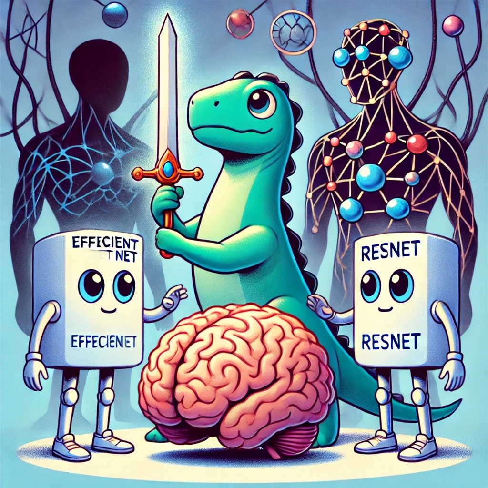

# ee046211-deep-learning

<h1 align="center">
  <br>
MRI Brain Alzheimer Classification Under Advarsarial Attacks
  <br>
  
</h1>

<h4 align="center">
    Dor Lerman:
  
  <a href="https://www.linkedin.com/in/..."></a>
    <a href="https://github.com/...."></a>
</a>

<h4 align="center">
    Niv Bar-Tov:
  
  <a href="https://www.linkedin.com/in/..."></a>
    <a href="https://github.com/....."></a>
</a>

Alzhiemer classification task

<h4 align="center">
    <a href="https://colab.research.google.com/github/taldatech/ee046211-deep-learning"></a>
    <a href="https://nbviewer.jupyter.org/github/taldatech/ee046211-deep-learning/tree/main/"></a>
    <a href="https://mybinder.org/v2/gh/taldatech/ee046211-deep-learning/main"></a>

</h4>
<p align="center">
    <a href="https://taldatech.github.io/ee046211-deep-learning/">Student Projects Website</a> • <a href="https://www.youtube.com/playlist?list=PLy3Xsl9jz-9WBHO850WFxv2TB5qtAlk0r">Video Tutorials (Winter 2024)</a>
  </p>


## Table of Contents

- [Project Overview](#project-overview)
- [Project Structure](#Project-Structure)
- [Installation](#installation)
- [Data](#data)
- [Model](#model)
- [Results](#results)
- [Usage](#usage)
- [Future Work](#future-work)
- [Sources and References](#sources-and-references)
- [License](#license)
- [Authors](#authors)


## Project Overview

## Project Structure
```
MRI_Brain_Alzheimer_Classification/
├── 🖼️ assets/
│   ├── 🔍 Dinov2/
│   │   ├── confusion_matrix.png
│   │   ├── loss_curve.png
│   │   └── accuracy_curve.png
│   ├── 🔍 Dinov2_atk/
│   │   ├── ... 
│   ├── 🔍 Efficientnet/
│   │   ├── ...
│   ├── 🔍 Efficientnet_atk/
│   │   ├── ...
│   ├── 🔍 Restnet/
│   │   ├── ...
│   └── 🔍 Resnet_atk/
│       ├── ...
├── ⛓️ checkpoints/
│   ├── 🎯 optuna/
│   │   ├── Dinov2/
│   │   ├── Dinov2_atk/
│   │   ├── Efficientnet/
│   │   ├── Efficientnet_atk/
│   │   ├── Restnet/
│   │   └── Resnet_atk/
│   ├── Dinov2/
│   │   ├── ...
│   ├── Dinov2_atk/
│   │   ├── ...
│   ├── Efficientnet/
│   │   ├── ...
│   ├── Efficientnet_atk/
│   │   ├── ...
│   ├── Restnet/
│   │   ├── ...
│   └── Resnet_atk/
│       ├── ...
├── 📊 dataset/
│   ├── dataset_variables/
│   │   ├── train_set.pt
│   │   ├── validation_set.pt
│   │   └── test_set.pt
│   ├── raw_dataset/
│   │   ├── train/
│   │   └── test/
│   └── prepare_dataset.ipynb
├── 🌐 env/
│   └── project_env.yaml
├── 📚 models/
│   ├── results.ipynb
│   ├── Dinov2.ipynb
│   ├── Dinov2_atk.ipynb
│   ├── Efficientnet.ipynb
│   ├── Efficientnet_atk.ipynb
│   ├── Restnet.ipynb
│   └── Resnet_atk.ipynb
└── 🛠️ utils/
    ├── optuna_search.py
    ├── utils_funcs.py
    └── grad_cam.py
```


## Installation

This code works with any OS - linux or windows. To setup all the required dependencies plesae follow the instructions below:

#### Conda

[Conda](https://docs.conda.io/projects/conda/en/latest/user-guide/getting-started.html) (Recommended) - Clone this repository and then create and activate the **`env/project_env.yaml`** conda environment using the provided environment definition:

```
conda env create -f env/project_env.yaml
conda activate project_env
```

#### Pip Install

Clone this repository and then use the provided **`env/requirements.txt`** to install the dependencies.

```
pip install -r env/requirements.txt
```

## Data

Our project utilizes the [Best Alzheimer's MRI Dataset](https://www.kaggle.com/datasets/lukechugh/best-alzheimer-mri-dataset-99-accuracy), a comprehensive and curated collection of MRI scans specifically designed for Alzheimer's classification. This dataset serves as an improved version of the raw dataset available [here](https://www.kaggle.com/datasets/tourist55/alzheimers-dataset-4-class-of-images).

To address class imbalance, the dataset incorporates synthetic images generated through advanced techniques, ensuring a more balanced distribution of classes. The original real images have been allocated to the test directory for thorough evaluation.

All images have been resized to **224x224 pixels** to meet the input requirements of the deep learning models used in this project. The data is organized as follows:


A **`prepare_dataset.ipynb`** notebook located in the **`dataset`** directory is responsible for splitting the data into:

- **80%** for training
- **10%** for validation
- **10%** for testing

The data is structured as follows:

- **Training Set**: Contains both synthetic and real images, providing a balanced source for model training.
- **Validation Set**: Used for hyperparameter tuning and monitoring model performance during training to help prevent overfitting.
- **Test Set**: Comprises only real images for an unbiased final evaluation of the trained models.


## Sources and References
